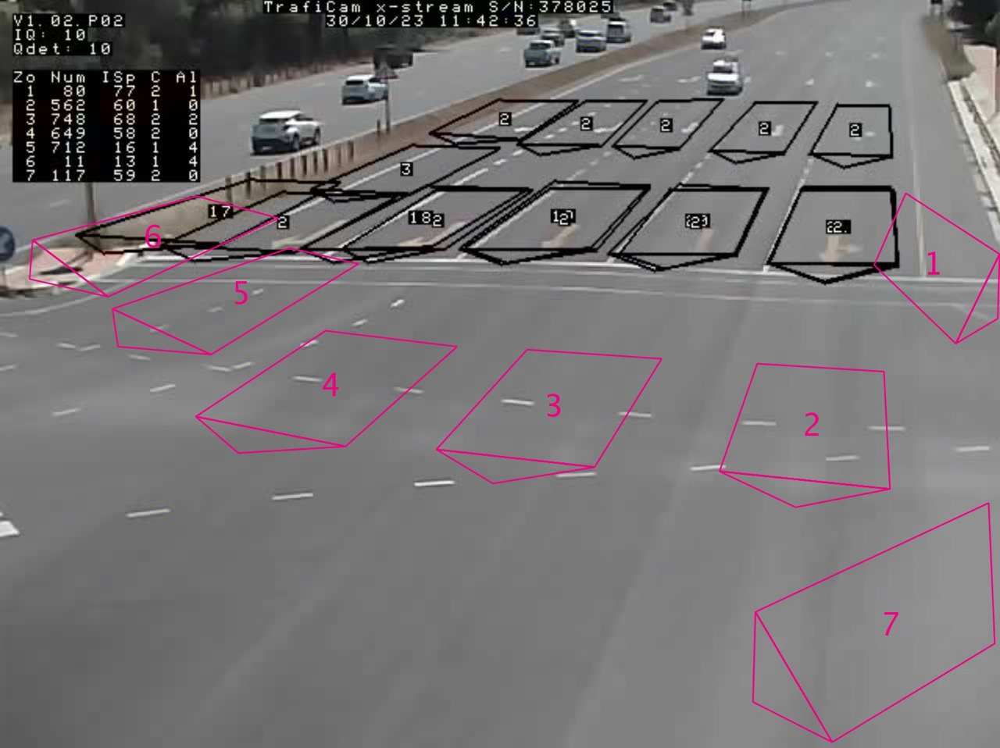
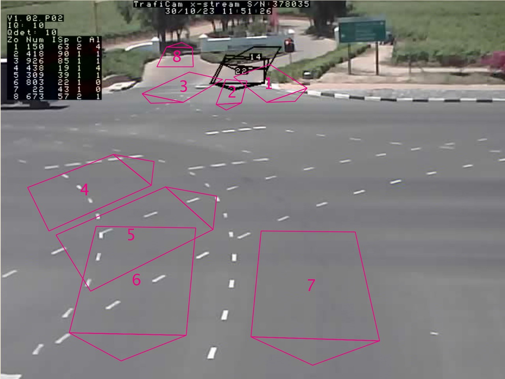
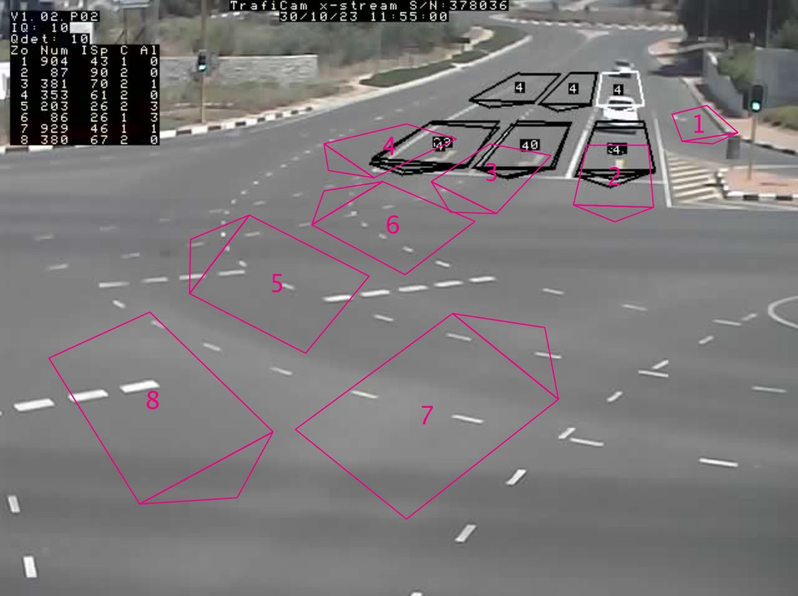
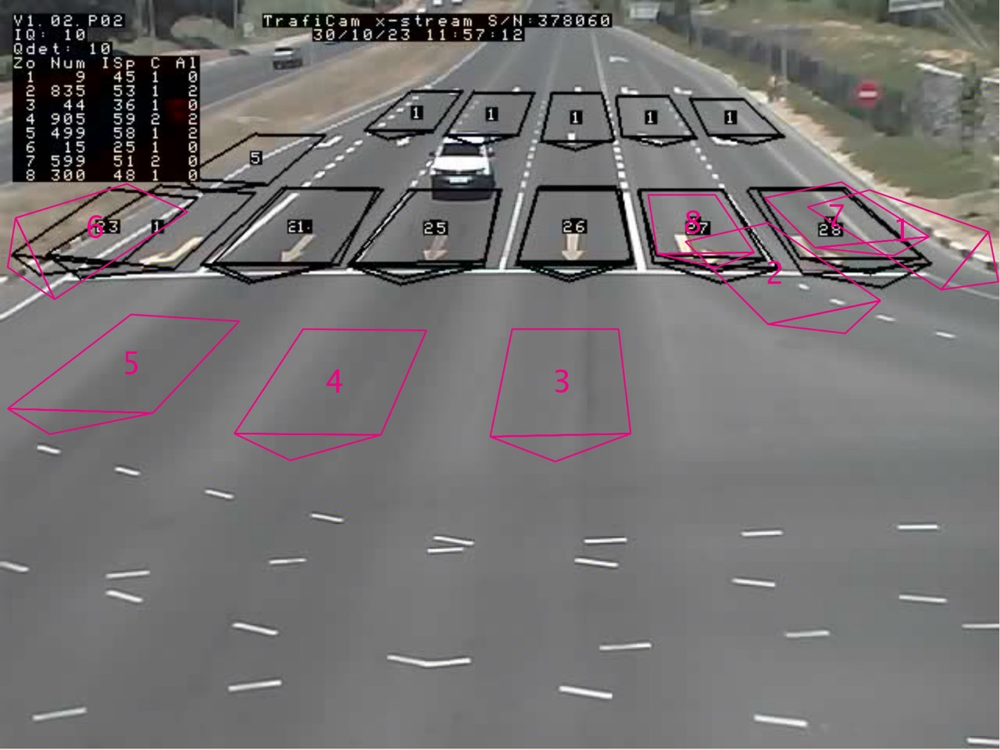
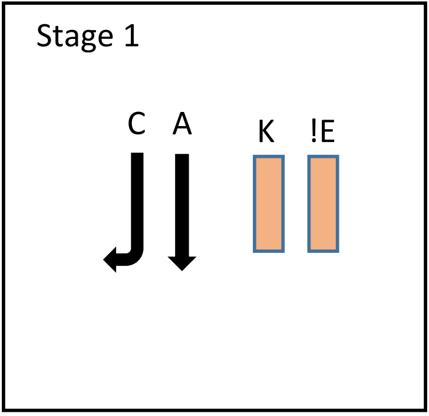
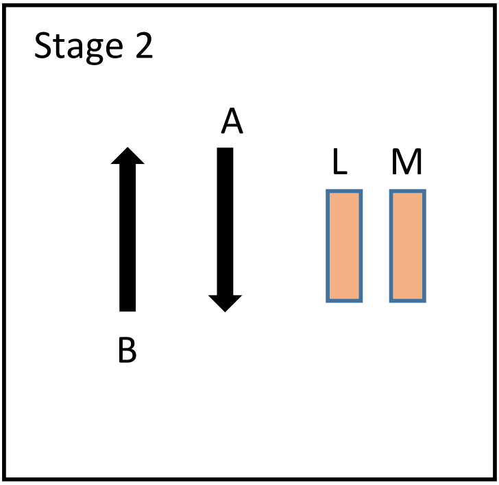
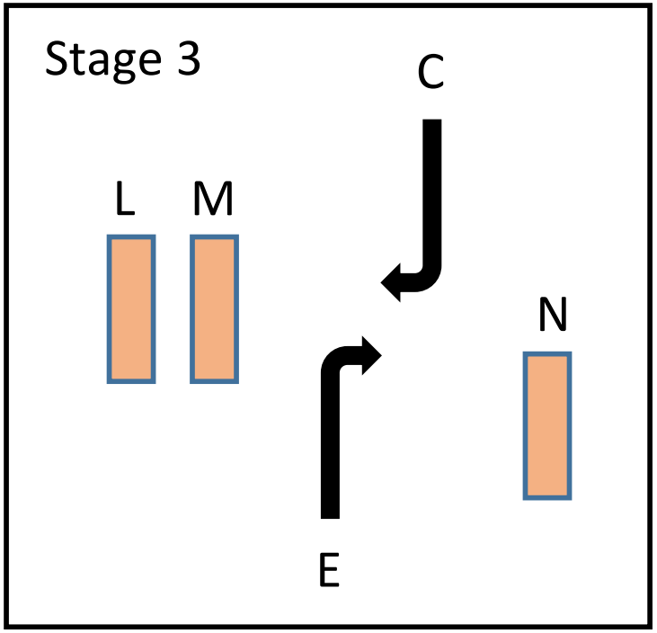
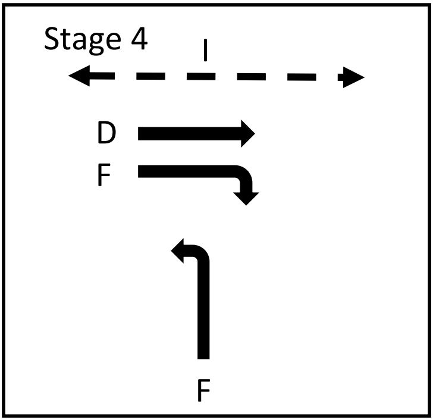
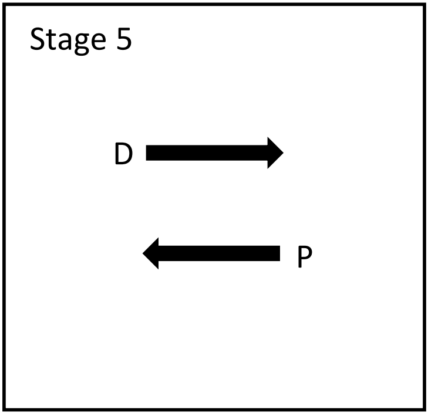
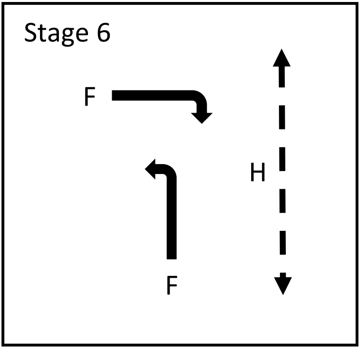

# Quebit Data Science Challenge
<p align="center">

</p>

# Background
Quebit is a subsidiary of Bytefuse that focuses on transport and traffic light optimization. As our solutions are data-driven, we are gathering large amounts of data and need skilled data engineers and data analysts to build the required pipelines to manage, process, and extract insights from datasets. The purpose of this challenge is to evaluate programming skills for candidate Quebit Data Scientists and Data Engineers.

# What we are looking for
- We mainly use Python at Quebit, so please complete the assignment in Python.
- You can use any Python package during this challenge (e.g., pandas, numpy, etc.).
- We are looking for candidates who can work in a structured manner and use versioning in a way to easily roll back when breaking changes are introduced. So, structure your code in logical directories and files to make it easy for the reviewer to read.
- As you complete the challenge, make sure to document functions as well as use descriptive messages for commit messages.
- We value readability over fewer lines of code.
- Query and process data in a logical and efficient manner.
- Provide good statistical insights when describing results and graphs obtained during the challenge.
- Provide clear instructions in your final submission on how to install and run your code. Your submission can either be in the form of a Jupyter Notebook or Python script, but everything should run by following the instructions. Remember to include the version of Python that should be used to run your code.


# How to submit
- The easiest way is to create a fork of this repo on Github and clone it.
- If you are not using Github, please make sure to host your repo somewhere where we can easily access it.
- Work on the challenge, committing regularly to document your progress. Try to have structured, meaningful commits, where each one adds significant functionality in a coherent manner.
- When you are done, email us a link to your repo. Email: cobus.louw@bytefuse.ai

**Be sure to watch the repo for bug fixes**

# Challenge
Quebit is currently deployed at an intersection in Stellenbosch where we are collecting traffic data. In this task, we would like you to extract various insights from the data as well as process the data to run a short simulation at the end of the challenge.

## Camera dataset
At the site where we are collecting data, we have four FLIR cameras deployed. Car counts are streamed over websockets and saved to a database on AWS. The setup looks like this:
<div align="center">
  <div style="display: flex; flex-wrap: wrap; justify-content: center;">
    <figure style="margin: 10px;">
      
      <figcaption>Stellenbosch | IP: 172.30.15.52</figcaption>
    </figure>
    <figure style="margin: 10px;">
      
      <figcaption>Blaauwklippen | IP: 172.30.15.53</figcaption>
    </figure>
  </div>
  <div style="display: flex; flex-wrap: wrap; justify-content: center;">
    <figure style="margin: 10px;">
      
      <figcaption>Technopark | IP: 172.30.15.54</figcaption>
    </figure>
    <figure style="margin: 10px;">
      
      <figcaption>Somerset West | IP: 172.30.15.55</figcaption>
    </figure>
  </div>
</div>
The counting zones are strategically placed to count the different turning movements at the intersection. There are 12 turning movements we want to track:

```
stellenbosch_to_blaauwklippen
stellenbosch_to_somersetwest
stellenbosch_to_technopark

blaauwklippen_to_somersetwest
blaauwklippen_to_technopark
blaauwklippen_to_stellenbosch

somersetwest_to_technopark
somersetwest_to_stellenbosch
somersetwest_to_blaauwklippen

technopark_to_stellenbosch
technopark_to_blaauwklippen
technopark_to_somersetwest
```


The following YAML allows us to map the detection zones of each camera to a turning movement. Be aware that some turning movements are counted by multiple detection zones/cameras.

```yaml
172.30.15.52:
    "1": "stellenbosch_to_blaauwklippen"
    "2": "stellenbosch_to_somersetwest"
    "3": "stellenbosch_to_somersetwest"
    "4": "stellenbosch_to_somersetwest"
    "5": "stellenbosch_to_technopark"
    "6": "stellenbosch_to_technopark"
    "7": "blaauwklippen_to_somersetwest"
172.30.15.53:
    "1": "blaauwklippen_to_somersetwest"
    "2": "blaauwklippen_to_technopark"
    "3": "blaauwklippen_to_stellenbosch"
    "4": "technopark_to_somersetwest"
    "5": "technopark_to_somersetwest"
    "6": "stellenbosch_to_technopark"
    "7": "stellenbosch_to_technopark"
    "8": "_to_blaauwklippen" # only counts cars driving towards Blaauwklippen
172.30.15.54:
    "1": "technopark_to_stellenbosch"
    "2": "technopark_to_blaauwklippen"
    "3": "technopark_to_somersetwest"
    "4": "technopark_to_somersetwest"
    "5": "stellenbosch_to_technopark"
    "6": "stellenbosch_to_technopark"
    "7": "blaauwklippen_to_stellenbosch"
    "8": "somersetwest_to_blaauwklippen"
172.30.15.55:
    "1": "somersetwest_to_technopark"
    "2": "somersetwest_to_technopark"
    "3": "somersetwest_to_stellenbosch"
    "4": "somersetwest_to_stellenbosch"
    "5": "somersetwest_to_stellenbosch"
    "6": "somersetwest_to_blaauwklippen"
    "7": "somersetwest_to_technopark"
    "8": "somersetwest_to_technopark"
```

## Traffic controller dataset
We are also integrated with the traffic light controller at the site. As the name suggests, the controller is responsible for controlling the traffic light. This is done by serving stages based on demand and extending stages to clear queues. A stage basically defines the permutation of lights that are green and red when it is served. The most important thing to know is that different stages serve different turning movements.
The following stages are defined at the site:

<div align="center">
  <div style="display: grid; grid-template-columns: repeat(3, 1fr); grid-gap: 5px; width: 70%">
    <figure style="margin: 0;">
      
    </figure>
    <figure style="margin: 0;">
      
    </figure>
    <figure style="margin: 0;">
      
    </figure>
    <figure style="margin: 0;">
      
    </figure>
    <figure style="margin: 0;">
      
    </figure>
    <figure style="margin: 0;">
      
    </figure>
  </div>
</div>
The following yaml defines which turning movements are served by each stage:

```yaml
stage_route_map:
  1:
    - "stellenbosch_to_blaauwklippen"
    - "stellenbosch_to_somersetwest"
    - "stellenbosch_to_technopark"
    - "technopark_to_stellenbosch"
    - "_to_blaauwklippen"
  2:
    - "stellenbosch_to_blaauwklippen"
    - "stellenbosch_to_somersetwest"
    - "stellenbosch_to_technopark"
    - "somersetwest_to_blaauwklippen"
    - "somersetwest_to_stellenbosch"
    - "somersetwest_to_technopark"
    - "technopark_to_stellenbosch"
    - "_to_blaauwklippen"
  3:
    - "stellenbosch_to_technopark"
    - "somersetwest_to_blaauwklippen"
    - "technopark_to_stellenbosch"
    - "_to_blaauwklippen"
  4:
    - "technopark_to_blaauwklippen"
    - "technopark_to_somersetwest"
    - "somersetwest_to_technopark"
    - "technopark_to_stellenbosch"
    - "_to_blaauwklippen"
  5:
    - "technopark_to_blaauwklippen"
    - "technopark_to_stellenbosch"
    - "technopark_to_somersetwest"
    - "blaauwklippen_to_stellenbosch"
    - "blaauwklippen_to_somersetwest"
    - "blaauwklippen_to_technopark"
    - "_to_blaauwklippen"
  6:
    - "technopark_to_somersetwest"
    - "somersetwest_to_technopark"
    - "technopark_to_stellenbosch"
# technopark_to_stellenbosch is "served" by every stage as these vehicles use a slip and do not cross the intersection
```

## 1. Query data from s3
Dumps of both the camera vehicle counts dataset as well as the controller's dataset have been uploaded to a public bucket on S3. The vehicle counts dataset can be found here: `s3://quebit-challenge/vehicle_counts.json` and the controller's dataset can be found here: `s3://quebit-challenge/controller.json`. You only have to work with data from `2024-03-08T17:00:00+02:00` to `2024-03-08T18:00:00+02:00`. Both `.json` files are large, and you should avoid downloading the entire file. It is therefore advisable to only query the required subset. Have a look at AWS's `SELECT` method to accomplish this task.

### 1.1 Query vehicle counts
Let's start by querying the vehicle dataset for vehicle counts for the previously defined period as well as for a subset of detection zones. Remember that some turning movements are counted by multiple cameras and detection zones. You can therefore **ignore** the following detection zones from each camera.

172.30.15.52: 5, 6

172.30.15.53: 1, 2, 3, 8

172.30.15.54: 3, 4, 5, 6

172.30.15.55: 7, 8

Only select rows within the specified time frame - `2024-03-08T17:00:00+02:00` to `2024-03-08T18:00:00+02:00`. Use the `time` column to make a selection based on time. The time format here is [ISO_8601](https://en.wikipedia.org/?title=ISO_8601).

### 1.2 Query stage informations
Query the `controller.json` file for information regarding stage changes. Rows where the `oid` column has a value of `3.6.1.4.1.13267.3.2.5.1.1.3` contains information regarding stage selections. Again only select information within the specified time frame. Use the `timestamp` column to select rows based time. Keep in mind that the format here is [Unix time](https://en.wikipedia.org/wiki/Unix_time).


## 2. Data processing and analysis

### 2.1 Vehicle counts
- Create a bar plot of the total volume of cars served for each turning movement
- Create a rolling mean line plot of 30 second throughput for each turning movement
- Create a visualisation to get insight of the gap time distribution. The gap time is the time in between consecutive vehicle counts.

### 2.2 Traffic light visualisation
- Visualise the distribution of green time extensions for each stage. Report and describe the distributions.
- Create a transistion matrix to show often traffic light switched from one stage to another.

### 2.3 Vehicle counts and traffic light stages joined
- Find a way to join staging data to the vehicle count dataset. The new dataframe should assign a stage to each vehicle counted. It therefore should show what stage was served when the vehicle was counted.
- Stage 2 and stage 4 served both vehicles from Somerset West to Technopark. Which stage served the most vehicles? Which stage had the highest vehicle rate.
- Vehicles should only cross the intersection during the designated stage assigned to the vehicle's turning movement. Report on trips (vehicle counts) that were counted within invalid periods i.e. their route wasn't served when they crossed the intersection. What route and stage had the most invalid trips?
- Report on green time utilisaton. Which stage had the longest duration where no cars were served and what was the duration.


## 3. Create a simulation based on vehicle counts and traffic light stage data (bonus question)
   
In this question you are going to create a digital twin of the scenario using the provided dataset. We've already provided the simulation and dependencies. You need to create two `.xml` files. The first will be responsible for generating traffic within the simulation. The second `.xml` file is going to dictate the stage of the traffic light... 